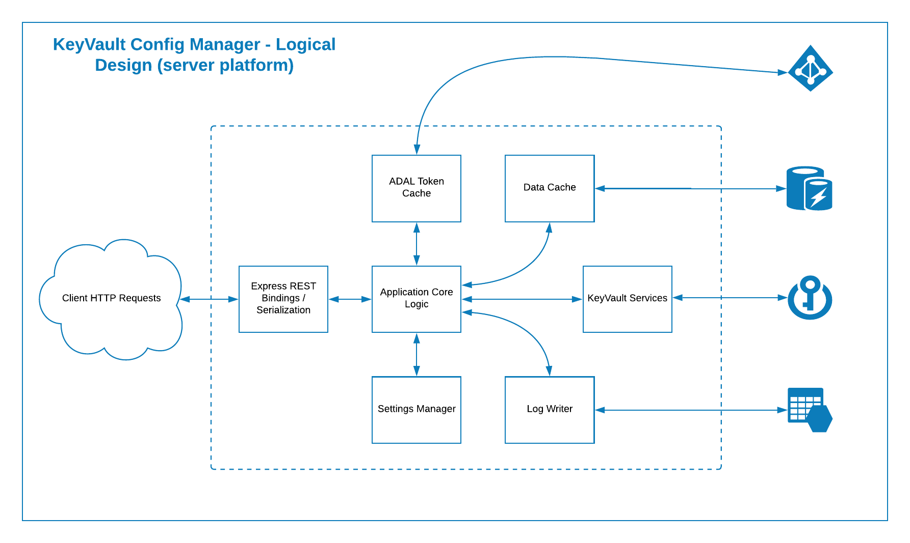

# KeyVaultConfigManager

Basic key/value configuration store based on Azure KeyVault. The idea is to allow applications
to store configuration values, and also provide a way to be notified when any of those values change.

### Basic Architecture

The server-side of the KeyVaultConfigManager is using a fairly standard scale-out design, leveraging 
a Redis cluster to offload direct query load from the underlying Key Vault:

